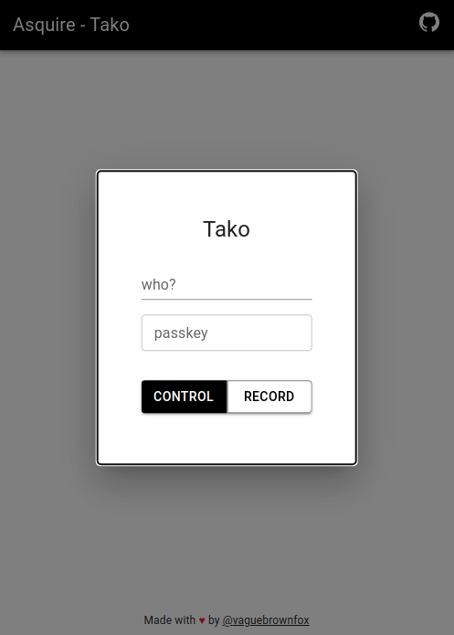
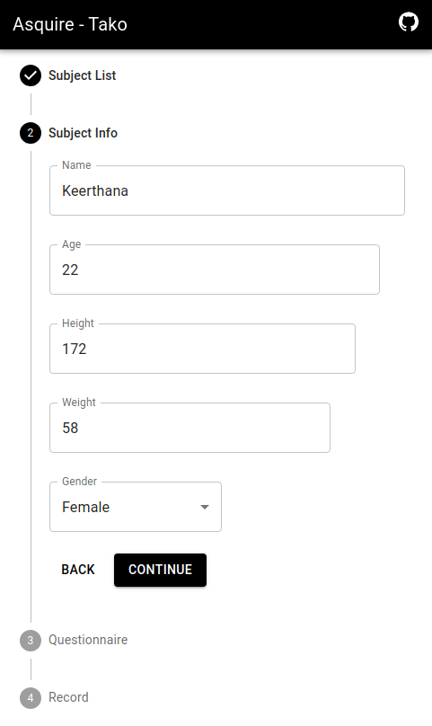
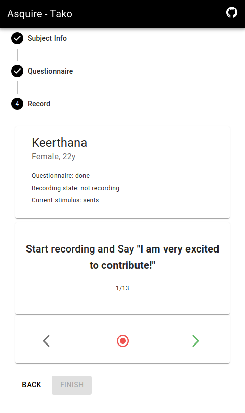
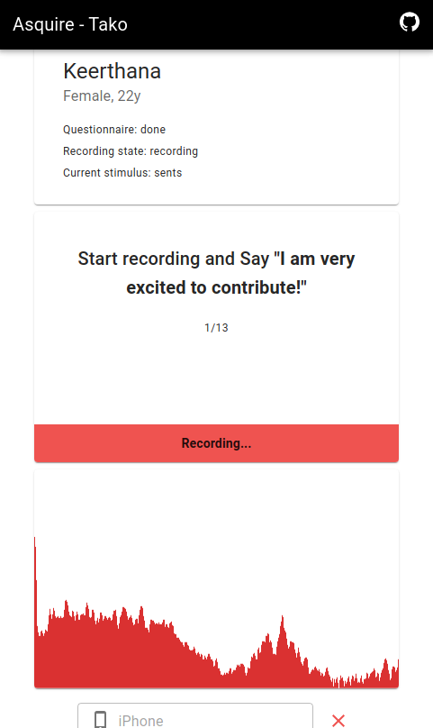
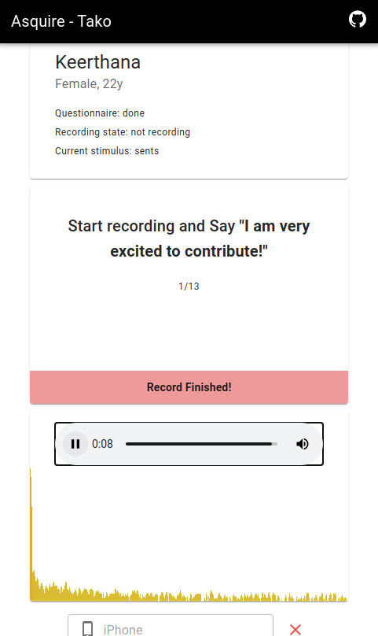
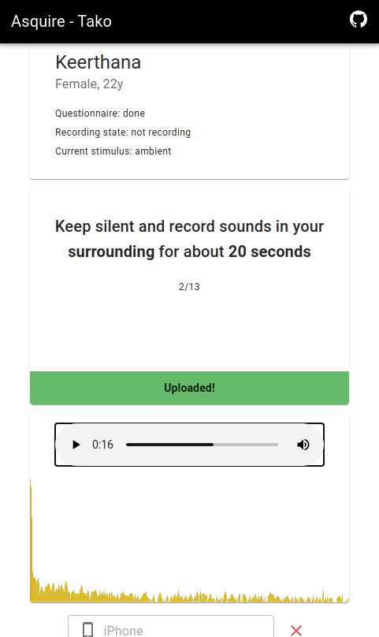

# Asquire Tako

Asquire-tako is a web application designed as an extension to the Asquire data collection application. It allows for simultaneous recording of voice data from multiple devices, with one device acting as the head device and controlling the other devices. The recorded audio is then uploaded to the cloud using Firebase as the backend.

## Description

Asquire-tako is developed as a complementary tool to Asquire, focusing on the simultaneous recording of voice data from multiple devices. It leverages the capabilities of web technologies and Firebase to provide a seamless recording experience and efficient cloud storage for the collected audio data.

The main goal of Asquire-tako is to enable researchers and healthcare professionals to gather voice data related to sustained phonations, breath sounds, and cough sounds from asthmatic patients from multilple everyday use devices like smartphones. The recorded audio can then be analyzed using data-driven and signal processing methods, as well as machine learning techniques, to aid in the diagnosis and monitoring of asthma.

## Features
1. Simultaneous recording from multiple devices:
    - One device acts as the head device and controls the other devices.
    - All devices record audio synchronously.

2. User-friendly web interface:
    - Intuitive controls for the head device.
    - Clear instructions for the controlled devices.
    - Switch head device if necessary

3. Firebase integration:
    - Integration with Firebase for backend services.
    - Cloud storage for the recorded audio data.

4. Secure and private:
    - User authentication to ensure authorized access.

## Usage
Asquire-tako works on any modern browser, follow these steps to use the web application:

#### On the head device:

    1. Open the web application URL in a web browser.
    2. Sign in to the application.
    3. Select the `Control` option on the interface.
    4. The recording controls are available to the head device

#### On the controlled devices:

    1. Follow Step 1 and 2 as Head
    2. Select `Record` option on the interface
    3. The device is now ready to record.

### Screenshots

    
    
    

    
    
    

